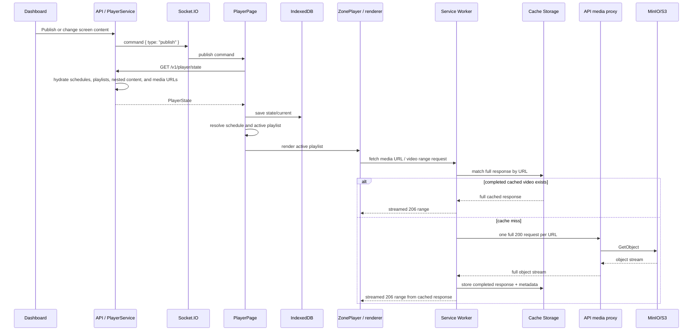

# Lumina Player — Current Playback and Caching Flow

Status: source-verified on 2026-08-28 after the additive Phase 2 manifest implementation.

This document describes what the web player does today. It is a map of the current system, not
the target offline-first architecture. The baseline procedure is in
[`docs/player-baseline-protocol.md`](./player-baseline-protocol.md).

## 1. System boundary

The active web path is:

```text
Dashboard publish/configuration
  -> API + PostgreSQL
  -> Socket.IO command and periodic player polling
  -> hydrated PlayerState JSON
  -> IndexedDB state snapshot
  -> local schedule selection
  -> React renderer
  -> Service Worker Cache Storage
  -> API media proxy
  -> MinIO/S3
```

The state snapshot and media bytes are independent. IndexedDB knowing a media URL does not mean
that the corresponding bytes are locally available or playable.

## 2. End-to-end sequence



On initial boot and every refresh, the same `GET /player/state` path is used. If that request
fails for a transient reason, `PlayerPage.loadState()` loads the last `state/current` value from
IndexedDB and continues with it. A `401` or `404` is treated as revoked pairing and clears local
application data instead.

## 3. Synchronization entry points

The synchronization owner is `apps/player/src/pages/PlayerPage.tsx`.

| Trigger | Current behavior |
| --- | --- |
| Authenticated player mount | Calls `loadState()` immediately. |
| Socket `publish` command | Calls `loadState()`, applies the returned state, and reschedules local transitions. |
| Socket reconnect | Calls `loadState()` after a real connection loss. |
| Periodic refresh | Calls `loadState()` every 60 seconds. |
| Local schedule boundary | Re-resolves the playlist from the already-loaded state without fetching new state. |
| Socket `reload` | Reloads the page. |
| Socket `clear-cache` | Clears IndexedDB and every Cache Storage cache, unregisters Service Workers, then reloads. |

`api.getPlaylist()` and the IndexedDB `playlist/current` store still exist for legacy
compatibility, but the current `PlayerPage` does not use them. The authoritative active path is
`api.getState()` plus `state/current`.

An additive `GET /player/manifest` contract now supplies a content revision and verified binary
metadata, but `PlayerPage` intentionally does not consume it yet. There is still no client-side
manifest comparison, synchronization transaction, or READY gate. Fresh `/player/state` data is
applied as soon as its JSON arrives, regardless of whether its referenced media is already stored.

## 4. Server-side state and URL generation

`apps/api/src/modules/player/player.controller.ts` exposes:

- `GET /player/state` for the full hydrated state.
- `GET /player/manifest` for the Phase 2 dependency-closed revision and verified binary list.
- `POST /player/heartbeat` for liveness and basic content presence.
- The legacy `GET /player/playlist` endpoint.

`PlayerService.getState()` reads the screen, schedules, emergency content, standalone asset,
wayfinding data, and nested playlist/theme/layout/design dependencies. `hydratePlaylist()`,
`hydrateThemeElements()`, `hydrateZones()`, and `hydrateDesign()` replace stored media references
with browser-facing URLs created by `StorageService.publicUrl()`.

In production, `CDN_BASE_URL` points to the API media route, so a hydrated video URL is ultimately
served by `MediaController`, which proxies a `GetObject` stream from MinIO/S3. It supports HTTP
Range and returns `Accept-Ranges`, `Content-Length`, and `Content-Range` where appropriate.

The legacy state response still identifies playback sources by URL. The additive manifest retains
stable asset IDs and provides per-binary SHA-256 versions and final sizes. Existing READY media
must be backfilled into `AssetBinary` before the endpoint will publish a complete manifest.

## 5. Local persistence

### LocalStorage

`apps/player/src/store/playerStore.ts` stores:

- `screen_id`
- `player_token`

Playback position and playlist progress are not persisted there.

### IndexedDB

`apps/player/src/lib/db.ts` opens `lumina-player`, version 3, with these stores:

| Store | Current use |
| --- | --- |
| `state` | One `current` hydrated `PlayerState`; used for transient-network fallback. |
| `playlist` | Legacy one-value store; helpers exist but the active player flow does not use them. |
| `config` | Generic device/application values. |
| `widgetCache` | Last-known live widget data keyed per widget. |

IndexedDB does not contain media files, per-asset readiness, download progress, hashes, quarantine
state, or an active/previous playlist transaction.

### Cache Storage

`apps/player/src/sw.ts` owns runtime media caching:

- App-shell files are Workbox precache entries.
- Images use a Workbox `CacheFirst` strategy in `media-cache`.
- `.mp4` and `.webm` videos use the custom Phase 0 route in the same binary cache.
- Video metadata is stored separately in `media-cache-metadata-v1` with `cachedAt`, `lastUsedAt`,
  and `sizeBytes`.
- Video eviction is metadata-based, with a seven-day age and 200-video entry limit.

A Cache Storage response is visible only after the full cache write completes. The Phase 0 handler
therefore makes all requests for one uncached URL join one full transfer, then serves requested
ranges from the completed cached response. Cached ranges are streamed without converting the
whole file to a Blob.

This is still opportunistic URL caching, not a durable download manager. There is no temporary
file record, resume support, checksum verification, quota reservation, or atomic playlist commit.

## 6. Playlist selection and rendering

`PlayerPage.resolvePlaylist()` selects content in this order:

1. Emergency playlist.
2. Standalone asset, already wrapped by the API as a one-item playlist.
3. Wayfinding renderer instead of a playlist.
4. Locally matched schedule rule.
5. Default playlist.

Power schedules and screen-stop state can blank or pause the presentation before normal content
is rendered.

`ZonePlayer` owns the item index for each playlist instance. Layout zones and nested theme
playlists create independent `ZonePlayer` instances, so their indices and timers are independent.

For ordinary playlist assets:

- Images render through `` and advance after `durationSecs`.
- Videos with `playFullVideo=false` advance on a timer or earlier `ended`.
- Videos with `playFullVideo=true` advance on `ended`.
- A one-item video playlist uses the native `loop` attribute.
- Documents page locally and advance after their pages complete.
- Theme, layout, design, and app items delegate to their specialized renderers.

The Phase 0 video watchdog in `ZonePlayer` allows 120 seconds for first playback, detects ten
seconds without progress after playback begins, and performs one local element remount. A later
failure skips the item in a multi-item playlist or displays `Media unavailable` for a one-item
playlist.

## 7. Preload and prefetch behavior

Current preloading is renderer-specific rather than driven by a complete dependency manifest.

| Location | Behavior | Limitation |
| --- | --- | --- |
| `ZonePlayer` | Calls `fetch()` for the next direct image/video asset. | Only looks one item ahead and only handles direct ASSET items. The first item has no head start. |
| `PlayerPage` wayfinding | Creates `Image` objects for all floor plans and POI icons. | Fire-and-forget; readiness is not tracked. |
| `DesignRenderer` | Warms next-scene images; uses a hidden `<video>` for a video background. | Hidden video may consume a hardware decoder; readiness is not tracked. Video elements are sometimes warmed through `Image`, which is not a reliable video preload contract. |
| `ThemeRenderer` | Direct elements load when rendered; nested playlists use `ZonePlayer`. | Direct theme video elements have native looping but no ZonePlayer watchdog. |

Only direct `ZonePlayer` video playback currently has bounded zero-progress recovery. Direct videos
inside themes and designs, including video scene backgrounds, do not yet share that recovery
controller.

## 8. Retry and failure behavior

### State synchronization

- Transient `getState()` failure: load the last IndexedDB state.
- `401`/`404`: clear application state and return to pairing.
- No exponential REST retry loop: recovery comes from the next socket reconnect, publish event,
  or 60-second refresh.
- Socket.IO reconnects with a delay beginning at two seconds and capped at 30 seconds.

### Media synchronization

- Concurrent requests for one video URL join one in-memory promise in the active Service Worker.
- A failed full video request is not cached.
- A later browser request can try again, but there is no explicit backoff, maximum download retry
  count, resumable transfer, or persisted failure state.
- Closing/restarting the Service Worker loses the in-flight ownership map.

### Playback

- Direct `ZonePlayer` videos have bounded recovery and diagnostic logs.
- Image decode/load errors do not currently have an equivalent recovery policy.
- Theme/design direct video elements do not currently have the ZonePlayer watchdog.
- A first-time uncached video waits for its full Cache Storage write before range playback can
  begin. The player has no committed-last-presentation layer to guarantee that an old frame stays
  visible during this wait.

## 9. Heartbeat, refresh, and connectivity

The player sends a heartbeat every 30 seconds with:

- `currentAssetId`
- `hasContent`

The API updates `lastSeenAt`, sets status to `ONLINE`, and forwards the status to dashboard socket
clients. It does not currently receive asset readiness, cache bytes, download state, failure code,
content revision, or last successful synchronization time.

There is no explicit `online`/`offline` event handler or network state machine. Offline behavior
emerges from failed REST requests, the IndexedDB state fallback, Socket.IO reconnect behavior, and
whatever media is already present in Cache Storage or the browser HTTP cache.

## 10. Asset deletion and cache reconciliation

The API refuses deletion while an asset is still referenced by a playlist, screen, or layout
zone. When an unreferenced asset is deleted, it removes the database record and, unless storage is
shared by another asset, its binary and thumbnail.

Players do not receive a delete-specific asset command and do not reconcile local bytes against a
manifest. Old cached URLs remain until age/entry eviction or an explicit `clear-cache` command.
This prevents a server deletion from immediately breaking already-cached playback, but also means
unused files are not removed deterministically.

## 11. Confirmed architecture gaps for the next milestones

1. The manifest contract exists, but the player does not consume or persist candidate revisions.
2. Existing production binaries need the one-time integrity backfill before their manifests pass.
3. New state activates before required media is locally READY.
4. No persistent download queue, `.part` lifecycle, resume, retry budget, or failure quarantine.
5. Cache Storage is keyed by URL and managed independently from IndexedDB state.
6. No active/previous playlist transaction or guaranteed last-good visual layer.
7. Recovery is inconsistent across `ZonePlayer`, Theme, and Design video paths.
8. Design video preloading can allocate an extra decoder.
9. Heartbeat cannot distinguish ONLINE, SYNCING, READY, DEGRADED, and ERROR.
10. No automatic end-to-end browser acceptance suite currently exists in `apps/player`.

These gaps are why Phase 0 remains stabilization only. Phase 3 must introduce storage that can use
the Phase 2 manifest to make local readiness computable before activation.
