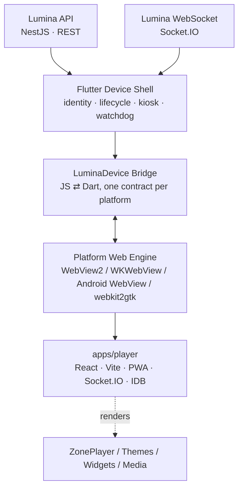
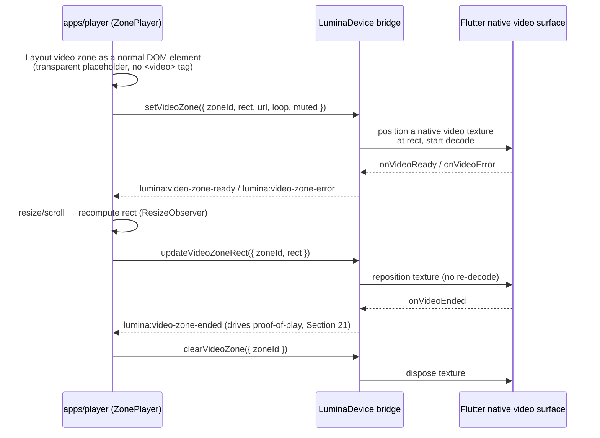
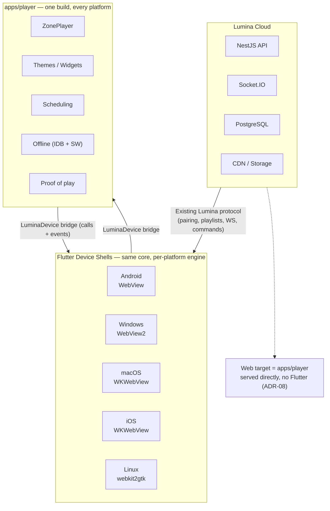

# Lumina Flutter Player --- Implementation Plan for Hamza

Repository (clone this first — everything referenced below lives here):

    https://github.com/BasSparkco/Lumina

## 1. Objective

Build a cross-platform Lumina device application in Flutter, targeting
**Android, iOS, Windows, macOS, Linux, and Web**, starting with Android
and adding the remaining targets once the Android MVP is proven on real
hardware.

The Flutter application must **not** replace or duplicate the existing
Lumina web renderer. The existing `apps/player` application remains the
single rendering engine for playlists, layouts, themes, widgets, media,
scheduling, and future embedded apps, on every platform.

The Flutter application is the native device shell around that renderer.



Primary rule:

> Flutter manages the device. The existing web player renders the
> content. On every platform, the rendered surface is the same
> `apps/player` build.

### Scope assumption

This plan's existing ADRs, testing matrix, and MVP scope assume the
**primary deployment target remains unattended signage kiosks** — the
use case `apps/player` and the backend modules under `apps/api` are
already built for. The task brief that produced this revision also asked
for hardware media-key handling, background audio session control, and
casting/AirPlay support. Those are real capabilities on phone/tablet/
desktop platforms but are unusual for a wall-mounted, always-on kiosk
that has no keyboard, no background state (it is always foregrounded),
and no reason to cast its own output elsewhere.

Rather than silently drop them or silently build them into the kiosk
critical path, this plan treats them as **optional, capability-gated
bridge methods** (Section 11) that only activate on platforms/deployment
modes where they make sense — e.g., a future companion "preview on this
device" mobile app, or a desktop installer used as a personal player
rather than a fleet kiosk. Do not block the Android kiosk MVP on any of
these. If the real intent is a second product (a general-purpose,
user-facing media player app, distinct from the signage kiosk shell),
say so explicitly and this plan should fork into two documents, because
the two have materially different security, lifecycle, and store-review
postures.

------------------------------------------------------------------------

## 2. Platform Target Matrix

Each platform embeds a different web engine with different
capabilities. Do not assume feature parity by default — every row below
is a place where the bridge must degrade gracefully (Section 11.3)
rather than assume a capability exists.

| Platform | Web engine | Flutter plugin | Primary use case | Distribution | Notable constraints |
|---|---|---|---|---|---|
| Android | Android System WebView (Chromium) | `webview_flutter` (Android impl) | Kiosk / signage box | Sideload, MDM, or Play Store | Hybrid composition needed for reliable video + hardware acceleration; Widevine L1/L3 available |
| Windows | Microsoft Edge WebView2 (Chromium) | `webview_windows` or `webview_flutter` (Windows impl) | Kiosk on Windows signage PCs | MSI/EXE installer, no store required | WebView2 Runtime must be present or bundled (Evergreen vs Fixed Version) |
| Linux | WebKitGTK (webkit2gtk) | `webview_flutter` (Linux, community-maintained) or native `webkit2gtk` binding | Kiosk on Linux signage boxes | .deb/.rpm/AppImage | Weakest video/DRM story of the five; hardware decode and Widevine support vary by distro/GPU driver |
| macOS | WKWebView (WebKit/Safari engine) | `webview_flutter` (macOS impl) | Kiosk on Mac hardware, or admin/companion use | Signed + notarized DMG/pkg, or Mac App Store | Same rendering engine family as iOS; FairPlay-only DRM path, no Widevine |
| iOS | WKWebView (WebKit/Safari engine, mandated by Apple on all iOS browsers/webviews) | `webview_flutter` (iOS impl) | Companion/preview app, tablet kiosk via Guided Access | App Store only | App Store review risk for thin wrappers (Section 22.2); background execution is heavily restricted |
| Web | N/A — this *is* the web target | N/A | Preview / embed only | Same CDN/host as `apps/player` today | See ADR-08: do not wrap `apps/player` in Flutter Web, serve it directly |

Two engine families exist: **Chromium** (Android WebView, WebView2,
and — if used — Linux CEF) and **WebKit** (WKWebView on iOS/macOS,
webkit2gtk on Linux). Any CSS/JS feature used by `apps/player` must be
verified against both families, not just Chrome desktop. WebKit is
consistently the more conservative engine for newer CSS, WebCodecs, and
autoplay/DRM behavior.

------------------------------------------------------------------------

## 3. Existing Lumina Code That Must Be Reused

The current repository already contains most of the web-side player
functionality. Do not rebuild these features in Dart unless a native
implementation is explicitly required.

### Existing player

Path:

    apps/player/

This is a Vite + React PWA and is already intended to be the
kiosk/WebView rendering target, on every platform.

Important existing dependencies include:

-   React
-   Vite
-   `vite-plugin-pwa`
-   `socket.io-client`
-   IndexedDB through `idb`
-   Zustand
-   QR code support (`qrcode`)
-   `html2canvas`
-   `@lumina/types`
-   `@lumina/prayer`
-   `@lumina/ui`

### Existing renderer

Important path:

    apps/player/src/components/ZonePlayer.tsx

`ZonePlayer.tsx` is the central playlist rendering path. It already
decides what is displayed according to the asset type.

Do not create equivalent Flutter widgets such as:

    FlutterImageRenderer
    FlutterVideoRenderer
    FlutterThemeRenderer
    FlutterTickerRenderer

unless a specific, measured performance problem on a specific platform
later proves that a native renderer is necessary (see ADR-07).

### Existing player components

The current player already contains components such as:

    CurrencyWidget.tsx
    DateWidget.tsx
    ErrorBoundary.tsx
    LiveWidget.tsx
    PrayerZoneWidget.tsx
    QrCodeWidget.tsx
    Splash.tsx
    TextAssetTicker.tsx
    ThemeRenderer.tsx
    TickerWidget.tsx
    TimeWidget.tsx
    WeatherWidget.tsx
    ZonePlayer.tsx

It also contains wayfinding components.

All of these remain web-rendered, on every platform.

### Existing player infrastructure

Review and reuse the behavior of:

    apps/player/src/lib/api.ts
    apps/player/src/lib/crashRecovery.ts
    apps/player/src/lib/db.ts
    apps/player/src/lib/kioskAnalytics.ts
    apps/player/src/lib/routing.ts
    apps/player/src/lib/scheduler.ts
    apps/player/src/lib/socket.ts
    apps/player/src/lib/tts.ts
    apps/player/src/lib/audioUnlock.ts

Before implementing an equivalent Flutter responsibility, determine
whether the existing web implementation should remain authoritative.
`audioUnlock.ts` in particular already solves autoplay-gating for web
audio contexts — check it before assuming native audio handling is
required.

------------------------------------------------------------------------

## 4. Existing Backend Modules

The API already contains dedicated domains that the Flutter player must
integrate with instead of creating a parallel backend protocol.

Relevant modules include:

    apps/api/src/modules/player
    apps/api/src/modules/ws
    apps/api/src/modules/screens
    apps/api/src/modules/playlists
    apps/api/src/modules/schedules
    apps/api/src/modules/proof-of-play
    apps/api/src/modules/kiosk-analytics
    apps/api/src/modules/power-schedules
    apps/api/src/modules/assets
    apps/api/src/modules/storage

The first implementation task is to document the exact existing
endpoints and Socket.IO events used by `apps/player` (see
`apps/player/src/lib/api.ts` and `apps/player/src/lib/socket.ts`,
including the existing `/player/check` pairing-status endpoint).

Do not introduce a second pairing, heartbeat, playlist, or command
protocol unless the current protocol cannot support the native shell.

------------------------------------------------------------------------

## 5. Shared Contracts

Review:

    packages/types/src/

The existing project deliberately uses shared TypeScript contracts
between the API, dashboard, and web player.

Flutter cannot directly consume TypeScript types, so avoid manually
inventing unrelated Dart models.

For every API response Flutter must consume:

1.  Identify the authoritative schema/type in `@lumina/types`.
2.  Create the corresponding Dart DTO.
3.  Document the source TypeScript type above the Dart model.
4.  Keep field names compatible with the server JSON.
5.  Prefer generated Dart models later if an OpenAPI/schema generation
    workflow is introduced.

The web renderer should continue consuming `@lumina/types` directly.
Flutter's own model surface should stay deliberately small — it only
needs pairing/device-identity and screen/health payloads, not the full
content-model graph, because content stays inside `apps/player`.

------------------------------------------------------------------------

## 6. Repository Placement

Recommended location:

    apps/flutter_player/

Do not replace:

    apps/player/

Proposed structure:

    apps/flutter_player/
    ├── lib/
    │   ├── app/
    │   ├── config/
    │   ├── core/
    │   ├── device/
    │   ├── bridge/
    │   ├── player/
    │   ├── services/
    │   │   ├── api/
    │   │   ├── websocket/
    │   │   ├── storage/
    │   │   ├── network/
    │   │   ├── heartbeat/
    │   │   ├── watchdog/
    │   │   └── logging/
    │   ├── platform/
    │   │   ├── android/
    │   │   ├── windows/
    │   │   ├── linux/
    │   │   ├── macos/
    │   │   └── ios/
    │   └── main.dart
    ├── android/
    ├── windows/
    ├── linux/
    ├── macos/
    ├── ios/
    ├── test/
    ├── pubspec.yaml
    └── README.md

Do not generate a `web/` target inside this Flutter project — see
ADR-08. Start with the `android/` target enabled. Keep the interfaces
under `lib/platform/` genuinely platform-neutral (an abstract
`WebEngineHost` + `DeviceCapabilities` interface) so each later target
is an additional implementation, not a redesign.

------------------------------------------------------------------------

## 7. Configuration

The existing web player currently uses:

    VITE_API_URL=http://localhost:4000/v1

Do not place server secrets inside Flutter.

Flutter may contain only public/client configuration such as:

    LUMINA_API_URL
    LUMINA_PLAYER_URL

Production credentials such as database passwords, JWT signing secrets,
S3 secret keys, or infrastructure credentials must never be bundled in
the application, on any platform.

Use compile-time environment configuration (`--dart-define` /
flavor-based) for development/staging/production, mirrored per platform:

-   Android: build flavors.
-   Windows/Linux/macOS: separate build configs or launch-time config
    file next to the executable.
-   iOS: build schemes, mindful that iOS forbids loading `http://` in
    production (App Transport Security) — staging/dev URLs must be
    HTTPS too, or explicitly exempted in `Info.plist`, which is itself
    an App Store review flag.

------------------------------------------------------------------------

## 8. Phase 0 --- Existing Player Analysis

Before writing the native integration, Hamza must trace the current
player lifecycle.

Document:

-   Player startup route.
-   How an unpaired device is identified.
-   Pairing-code generation.
-   Pairing confirmation.
-   Device token storage.
-   Player authentication.
-   Playlist/schedule retrieval.
-   Socket.IO connection.
-   Heartbeat implementation.
-   Remote commands.
-   Offline database behavior.
-   Asset caching behavior.
-   Crash recovery.
-   Proof-of-play.
-   Kiosk analytics.
-   Power scheduling.
-   Screenshot functionality, if currently implemented.

Deliverable:

    apps/flutter_player/docs/existing-player-contract.md

This document becomes the compatibility contract between Flutter and
`apps/player`, and the baseline every later platform is checked against
for rendering/behavior parity.

------------------------------------------------------------------------

## 9. Phase 1 --- Flutter Android Shell

Create the Flutter project and produce an Android APK containing a
full-screen WebView.

Initial requirements:

-   Full-screen mode.
-   Immersive Android UI.
-   Keep screen awake.
-   JavaScript enabled.
-   DOM storage enabled.
-   Hardware acceleration.
-   Media playback support.
-   Autoplay support suitable for signage.
-   Correct landscape and portrait rendering.
-   Navigation blocked from leaving the Lumina player.
-   External unexpected URLs rejected or handled explicitly.
-   WebView errors logged.
-   Renderer reload capability.

First acceptance test:

> The same Lumina screen that works in desktop Chrome must display
> correctly inside the Flutter Android WebView.

Test at minimum:

-   Image
-   Video
-   Text
-   Theme
-   Ticker
-   Clock/date
-   Weather
-   Prayer widget
-   QR code
-   Multi-zone layout

Do not proceed to advanced native features until rendering parity is
acceptable.

------------------------------------------------------------------------

## 10. Phase 2 --- Native Device Identity

Flutter owns the installation-level device identity.

Implement persistent local storage for:

-   Installation ID
-   Device token, when issued
-   Player version
-   Server environment
-   Last successful startup
-   Native device capabilities

The existing server pairing protocol should be reused (see
`checkPairing` / `/player/check` in `apps/player/src/lib/api.ts`).

Do not invent a new pairing system.

Expected lifecycle:

    First Launch
        |
    Installation ID
        |
    Existing Lumina Pairing API
        |
    Pairing Code
        |
    Dashboard assigns screen
        |
    Device credentials stored
        |
    Player becomes active

Sensitive device credentials must use secure platform storage where
practical (`flutter_secure_storage` or equivalent — Android Keystore,
iOS/macOS Keychain, Windows DPAPI, Linux Secret Service where available;
fall back to file storage with restricted permissions where a platform
keyring is not available, e.g. headless Linux boxes without a keyring
daemon).

------------------------------------------------------------------------

## 11. Phase 3 --- WebView / Flutter Bridge Architecture

This is the single most important interface in the whole system: it is
the seam that lets `apps/player` stay identical across six platforms
while native capability varies underneath it. Design it once, design it
small, and treat every method as a public API with a compatibility
obligation.

### 11.1 Bridge namespace and transport

Expose one stable JavaScript/native bridge namespace:

    LuminaDevice

The renderer must never need to know whether it is running in Chrome,
Android, Windows, macOS, Linux, or iOS.

Transport is platform-specific but the message shape is not:

-   **Android / iOS / macOS / Linux / Windows (webview_flutter):** a
    `JavascriptChannel` (`LuminaDeviceChannel.postMessage(...)`) for
    web→native calls, and `runJavaScript()` /
    `evaluateJavascript()` for native→web calls and event dispatch.
-   **Windows (webview_windows / WebView2 native):** `postMessage` over
    the WebView2 `CoreWebView2.WebMessageReceived` channel.

`apps/player` should never call the raw channel object directly. Wrap
it in a small `window.LuminaDevice` shim (shipped as part of
`apps/player`, not injected ad hoc by Flutter) that:

1.  Detects whether a native bridge is present at all (falls back to a
    "browser" no-op implementation so `apps/player` keeps working
    unmodified in plain desktop Chrome for development).
2.  Provides Promise-based method calls over the underlying
    fire-and-forget channel, using a request ID + response event.
3.  Provides an `EventTarget`-style subscription API for native→web
    events.

### 11.2 Message envelope

Use one JSON envelope shape for every direction, so logging, replay,
and versioning stay simple:

```json
{
  "id": "b3f1c2-req-042",
  "type": "call",
  "method": "getDeviceInfo",
  "params": {},
  "bridgeVersion": 1
}
```

```json
{
  "id": "b3f1c2-req-042",
  "type": "result",
  "ok": true,
  "result": { "platform": "android", "osVersion": "14" },
  "bridgeVersion": 1
}
```

```json
{
  "id": "b3f1c2-req-042",
  "type": "result",
  "ok": false,
  "error": { "code": "UNSUPPORTED", "message": "castTo is not available on this platform" },
  "bridgeVersion": 1
}
```

```json
{
  "type": "event",
  "event": "lumina:network-changed",
  "payload": { "online": false },
  "bridgeVersion": 1
}
```

`bridgeVersion` lets `apps/player` detect a native shell too old for a
method it wants to call, and degrade instead of throwing.

### 11.3 Method catalog

Core (required on every platform, MVP scope):

    LuminaDevice.getPlatform()
    LuminaDevice.getPlayerVersion()
    LuminaDevice.getDeviceInfo()
    LuminaDevice.getNetworkStatus()
    LuminaDevice.setVolume(value)
    LuminaDevice.getVolume()
    LuminaDevice.reloadRenderer()
    LuminaDevice.restartPlayer()
    LuminaDevice.clearNativeCache()
    LuminaDevice.reportRendererAlive()
    LuminaDevice.reportError(error)
    LuminaDevice.requestScreenshot()
    LuminaDevice.getCapabilities()

`getCapabilities()` returns the allowlist of methods/events this
specific native build actually supports on this specific platform (see
Section 11.4). `apps/player` must call it once at startup and treat
absence as the default, rather than probing by calling a method and
catching an error.

Optional / capability-gated (Section 1's scope assumption — not
required for the signage kiosk MVP, but part of the bridge contract so
a companion/preview app can adopt them without a new bridge design):

    LuminaDevice.onHardwareMediaKey(handler)   // play/pause/next/prev from OS media controls
    LuminaDevice.setBackgroundAudioEnabled(bool) // keep audio session alive while backgrounded
    LuminaDevice.getCastTargets()              // discover Chromecast / AirPlay receivers
    LuminaDevice.castTo(targetId)
    LuminaDevice.stopCasting()
    LuminaDevice.lockOrientation(mode)
    LuminaDevice.requestFullscreen() / exitFullscreen()

Native video compositing (escape hatch only — Linux default,
Android/Windows/macOS/iOS evidence-gated per ADR-07; see the
compositing pattern in Section 23.5):

    LuminaDevice.setVideoZone({ zoneId, rect, url, loop, muted })
    LuminaDevice.updateVideoZoneRect({ zoneId, rect })
    LuminaDevice.clearVideoZone({ zoneId })

Native-to-web events:

    lumina:native-ready
    lumina:network-changed
    lumina:resume
    lumina:pause                (backgrounded — mobile/desktop windowing only, never fires in kiosk mode)
    lumina:device-command
    lumina:configuration-changed
    lumina:cast-state-changed
    lumina:media-key
    lumina:video-zone-ready     (native video compositing escape hatch, Section 23.5)
    lumina:video-zone-ended
    lumina:video-zone-error

### 11.4 Capability negotiation and graceful degradation

Capabilities that do not exist on a platform (or in a given deployment
mode, e.g. locked-down kiosk vs companion app) must return a
structured `UNSUPPORTED` result rather than causing a JavaScript error,
and must be absent from `getCapabilities()` so `apps/player` can hide
any UI affordance for them (e.g. do not render a cast button on a Linux
kiosk box that has no cast transport implemented).

### 11.5 Security of the bridge itself

-   Every bridge method must validate its `params` shape/types before
    acting — treat web content as untrusted input, even though it is
    first-party (see Security Rules, Section 25).
-   The channel must only be injected into frames loaded from the
    configured `LUMINA_PLAYER_URL` origin — never into an
    iframe/subframe from another origin, and never after an
    unexpected navigation (Section 25).
-   Native remote commands arriving from the server (Section 15) go
    through the same allowlisted method catalog; there is exactly one
    path from "server says do X" to "device does X", not one path for
    web-triggered bridge calls and a separate one for server-triggered
    native commands.

Keep this bridge small. Business logic remains in the web player/API.

------------------------------------------------------------------------

## 12. Phase 4 --- Native Device Service

Create a Flutter device service responsible for platform information.

Collect only useful operational information:

-   Platform
-   OS version
-   Player version
-   Screen resolution
-   Orientation
-   Available storage
-   Network state
-   Application uptime

CPU/RAM/device model may be added where reliably available.

Do not make the renderer depend on hardware fields that are unavailable
on another platform — always go through `getCapabilities()`
(Section 11.4).

------------------------------------------------------------------------

## 13. Phase 5 --- Heartbeat Responsibility

The current web player already has server communication logic, so avoid
accidentally sending two independent heartbeats for one physical screen.

During Phase 0, determine which layer currently owns heartbeat.

Recommended long-term split:

-   Flutter: native device health.
-   Web player: renderer/playback health.
-   Server: combines both into screen health.

If changing the backend contract is unnecessary for MVP, retain the
existing web heartbeat and add only renderer/native watchdog signals
locally.

Later, a native health payload may include:

    platform
    appVersion
    rendererAlive
    networkOnline
    uptime
    storageFree
    currentPlayerState

------------------------------------------------------------------------

## 14. Phase 6 --- Socket.IO and Remote Commands

The repository already uses `socket.io-client` in `apps/player`.

Do not immediately create a second Flutter Socket.IO connection.

For MVP:

-   Keep existing real-time player events in `apps/player`.
-   Use the JavaScript bridge when a server command requires native
    action.

Example:

    Server
      |
    Existing Web Socket
      |
    apps/player
      |
    LuminaDevice.restartPlayer()
      |
    Flutter

Native-only commands can include:

-   Restart native player.
-   Reload WebView.
-   Clear native cache.
-   Set volume.
-   Enter/reapply kiosk mode.
-   Gather device information.
-   Screenshot.
-   Reboot device only when Android permissions/device management permit
    it.

A second native socket connection should only be introduced if there is
a documented reliability or architectural reason.

------------------------------------------------------------------------

## 15. Phase 7 --- Offline Strategy and Cache Management

This is a critical design decision.

The existing PWA already uses IndexedDB and a service worker. Flutter
can also provide native file caching, but two independent caches can
create complexity and stale-content bugs.

Therefore implement offline support in two stages.

### MVP

Preserve the existing PWA offline behavior.

Verify per platform that the WebView supports:

-   Service worker behavior required by the player.
-   IndexedDB.
-   Cached player shell.
-   Cached playlist data.
-   Cached media behavior.

Service worker support is not uniform:

-   Android WebView, WebView2, WKWebView (iOS 11.3+/macOS): supported.
-   webkit2gtk on Linux: service worker support depends on the
    distro-packaged WebKitGTK version; treat as unverified until tested
    on the actual target image, and have a native-cache fallback plan
    for Linux specifically if it is missing.

Test by physically disconnecting the device from the network, on every
platform before shipping that platform.

### Native cache upgrade

Only after measuring the PWA/WebView limitations, per platform, should
Flutter become responsible for large media downloads.

If native media caching is added:

-   Server playlist metadata remains authoritative.
-   Files are downloaded before activation.
-   SHA-256 or equivalent integrity validation is used.
-   Existing active content remains untouched until the new content is
    complete.
-   Failed updates never leave the display blank.
-   Cache eviction must not remove assets required by the active or
    fallback playlist.
-   The bridge exposes a narrow `LuminaDevice.clearNativeCache()` /
    future `LuminaDevice.getCacheStatus()` pair rather than exposing
    the filesystem to web content.

Do not build the native media cache in the first Flutter milestone
unless WebView caching proves inadequate.

### DRM / protected content

Not currently a stated requirement, but flag it now because it is
platform-fragmenting if it ever becomes one:

-   Widevine (Android WebView, WebView2/Chromium): L1/L3 available,
    generally solid.
-   FairPlay (WKWebView, iOS/macOS): different key-exchange model,
    requires a FairPlay-specific streaming setup (HLS + FPS), not a
    drop-in replacement for a Widevine pipeline.
-   webkit2gtk (Linux): typically **no** hardware-backed DRM without a
    vendor-specific patched build.

If protected content is ever required, it becomes a sixth
platform-matrix column, not an incremental feature.

------------------------------------------------------------------------

## 16. Phase 8 --- Watchdog

Flutter should add reliability that a normal browser cannot provide.

Implement two watchdog levels.

### WebView health

The renderer periodically reports:

    LuminaDevice.reportRendererAlive()

Flutter tracks the timestamp.

If renderer heartbeat stops:

1.  Wait a conservative timeout.
2.  Reload WebView.
3.  If repeated failures occur, recreate the WebView.
4.  If failures continue, restart the Flutter player process where
    practical.
5.  Preserve diagnostics for the server/local log.

### Playback health

Do not assume that a responsive WebView means content is advancing.

Later add web-side signals such as:

    renderer-ready
    playlist-loaded
    item-started
    item-ended
    playback-error

Use these signals for diagnostics before adding aggressive automatic
recovery.

Avoid restart loops.

------------------------------------------------------------------------

## 17. Phase 9 --- Crash Recovery and Fallback

The current project already contains:

    apps/player/src/lib/crashRecovery.ts
    apps/player/src/components/ErrorBoundary.tsx

Review and preserve this behavior.

Flutter adds an outer recovery layer.

Recovery order:

    Normal renderer
        |
    WebView reload
        |
    WebView recreation
        |
    Last known working player URL/state
        |
    Native fallback screen

The native fallback screen should be simple and branded, never a raw
platform/WebView error page (no raw "This site can't be reached", no
raw NSURLError dialog, no Windows WebView2 crash banner).

A signage screen should not remain permanently black after a recoverable
failure, on any platform.

------------------------------------------------------------------------

## 18. Phase 10 --- Android Boot and Kiosk

After WebView playback is stable, implement Android-specific operation.

Requirements:

-   Start player after device boot where Android/device policy permits.
-   Keep display awake.
-   Immersive full screen.
-   Hide system UI.
-   Restore immersive mode after interruptions.
-   Prevent accidental back navigation.
-   Configurable orientation.
-   Recover when application returns from background.
-   Lock Task / dedicated-device support where deployment model permits
    it.

Separate normal APK behavior from managed-device behavior.

Do not assume silent reboot, silent APK installation, or full kiosk
control is possible on every consumer Android device.

Document capabilities by deployment mode:

    Standard Android APK
    Managed / Device Owner Android
    Vendor-specific Android box

------------------------------------------------------------------------

## 19. Phase 11 --- Volume and Media

Implement native volume control through `LuminaDevice`.

Do not replace HTML video playback initially.

First test the existing web video renderer inside each platform's
WebView for:

-   H.264 playback
-   Muted autoplay
-   Audio playback
-   Looping
-   Long videos
-   Playlist transition after video end
-   Recovery after network interruption
-   Resume after application lifecycle changes
-   1080p hardware decoding
-   4K only on hardware intended to support it

If WebView video is unreliable on target hardware, introduce the native
video compositing pattern (Section 23.5) for video assets only, while
preserving the web renderer for everything else. On Android/Windows/
macOS/iOS that decision must be evidence-based, not part of the initial
architecture; on Linux it is the default from day one (ADR-07).

### Hardware media keys and background audio (capability-gated)

For the kiosk deployment mode, these do not apply — a kiosk has no
attached keyboard and is never backgrounded. Implement them only when a
companion/preview build needs them (Section 1 scope assumption):

-   Android: `MediaSession` integration surfaces play/pause/next/prev
    to Bluetooth headsets, lock screen, and Android Auto-style
    surfaces; wire through `LuminaDevice.onHardwareMediaKey()`.
-   iOS/macOS: `MPRemoteCommandCenter` + `MPNowPlayingInfoCenter` play
    the same role; background audio additionally requires the
    `audio` UIBackgroundMode entitlement on iOS, which App Review
    checks is genuinely used for audio, not as a way to keep an
    otherwise-idle webview alive in the background.
-   Windows: System Media Transport Controls (SMTC).
-   Linux: MPRIS (`org.mpris.MediaPlayer2`) over D-Bus, desktop
    environment dependent.

### Casting / AirPlay (capability-gated)

Web content inside a WebView cannot natively drive Chromecast or
AirPlay device pickers — the OS picker UI is native chrome, not a web
API. If casting is genuinely needed for a companion app:

-   Android: Google Cast SDK, invoked natively and exposed to
    `apps/player` only as `getCastTargets()` / `castTo()` / cast-state
    events (Section 11.3) — never expose the Cast SDK object graph
    itself to JS.
-   iOS/macOS: `AVRoutePickerView` (AirPlay) works with native
    `AVPlayer` playback; WKWebView's HTML5 `<video>` has limited,
    version-dependent AirPlay support (`x-webkit-airplay="allow"`) and
    should not be relied on as the primary path if AirPlay is a hard
    requirement.
-   For a kiosk, skip this entirely — a screen bolted to a wall is
    itself the cast target, not a cast source.

------------------------------------------------------------------------

## 20. Phase 12 --- Screenshots and Diagnostics

The repository already includes `html2canvas`.

Determine how screenshots currently work before adding native capture.

Preferred behavior:

    Dashboard request
       |
    Existing server command
       |
    Web renderer/native bridge
       |
    Screenshot
       |
    Existing upload/API path

Native screen capture should be used only if it provides a meaningful
advantage over the current renderer capture.

Diagnostics should record:

-   Player startup
-   Pairing
-   WebView initialization
-   Renderer ready
-   Renderer load failure
-   Network lost/restored
-   Watchdog recovery
-   Native command received
-   Application lifecycle change
-   Version
-   Device storage warnings

Do not continuously upload noisy logs.

------------------------------------------------------------------------

## 21. Phase 13 --- Proof of Play

Proof-of-play already exists as a backend domain and should remain tied
to the web playback engine.

Flutter must not independently claim that an asset played merely because
the WebView was alive.

The web renderer knows which playlist item actually started and ended.

Keep proof-of-play in the existing player/API flow.

Flutter may add native health metadata to those events later if useful.

------------------------------------------------------------------------

## 22. Phase 14 --- Single-Source Update Model (Zero Native Re-deployments)

This is the architectural promise this whole plan exists to deliver, so
it gets stated precisely rather than as an aspiration.

### 22.1 What "zero re-submission" actually means here

`apps/player` is loaded by every native shell as a **remote HTTPS URL**
(`LUMINA_PLAYER_URL`), not as bundled assets compiled into the app.
Concretely:

    apps/player deploy (existing CI/CD, unchanged)
        |
    New build live at LUMINA_PLAYER_URL
        |
    Every already-installed Flutter shell, on every platform,
    loads the new build on its next navigation/reload —
    no APK/EXE/DMG/IPA rebuild, no store review, no fleet redeploy.

This is true for: playlist rendering logic, themes, widgets, layout
engine, ZonePlayer behavior, scheduling logic, proof-of-play client
logic, and UI/UX fixes — i.e. everything Section 3 says stays in
`apps/player`.

It is **not** true for anything that lives in the Flutter shell itself:
the bridge method catalog, kiosk/boot behavior, watchdog thresholds,
native device-identity storage, platform permission requests. Changing
those still requires a native build and (for iOS, and optionally
Android/macOS) store review. Keeping the shell's responsibilities
narrow (Section 1, ADR-02) is what keeps this category of change rare.

### 22.2 App Store review risk — say it plainly

A native app whose entire visible surface is a webview pointed at a
remote URL is a known review risk on Apple's App Store (Guideline 4.2,
"Minimum Functionality" — "your app should include features, content,
and UI that elevate it beyond a repackaged website"). This plan already
mitigates that risk by construction, and it should stay that way:

-   The Flutter shell owns real native functionality independent of
    web content: device pairing UI, kiosk/boot configuration, native
    diagnostics, watchdog/recovery, and (per Section 19) optionally
    native media-session/AirPlay integration. That is substantive
    native functionality, not padding.
-   Do not ship an iOS build that is *only* a full-screen WebView with
    no native chrome, settings, or pairing flow — that is exactly the
    shape Apple rejects under 4.2.
-   For a pure kiosk deployment mode with no consumer App Store
    distribution (sideloaded/MDM-installed on owned hardware), 4.2 does
    not apply — this risk is specifically about any build submitted to
    the public App Store, i.e. a future companion/preview app.

### 22.3 Remote config, not remote code injection

`LUMINA_PLAYER_URL` itself should be configurable per environment
(dev/staging/prod) but should not become a place to remotely repoint a
fleet of devices to an arbitrary attacker-controlled URL:

-   Pin the allowed origin(s) per build/environment; the bridge
    (Section 11.5) refuses to attach to any other origin.
-   If remote environment-switching is ever needed operationally, it
    must go through the existing authenticated screen/device APIs
    (Section 4), signed the same way remote commands are, not through
    an unauthenticated config file.

### 22.4 Flutter/native updates

APK/EXE/DMG/pkg/IPA updates are required only for native-shell
functionality.

For MVP, use controlled/manual deployment per platform. Later support
managed updates depending on installation type (MDM push for
Android/Windows fleets, Sparkle-style updater for macOS installer
builds, standard store updates for iOS/Mac App Store builds).

Never implement an insecure self-updater that downloads and installs
arbitrary binary URLs.

Any future updater must verify:

-   Trusted update source.
-   Package identity.
-   Version.
-   File integrity/signature.

------------------------------------------------------------------------

## 23. Performance and Hardware Acceleration

Video is the highest-risk rendering path across this platform matrix;
everything else (`image`, `text`, `theme`, `ticker`, widgets) is cheap
DOM/CSS work that all five web engines handle comparably well.

### 23.1 WebView composition mode (Android specifics)

`webview_flutter` on Android can run in **virtual display** or
**hybrid composition** mode. Hybrid composition is required for
reliable video playback, on-screen keyboards, and certain hardware
surfaces, at some extra rendering cost; virtual display is cheaper but
has known video/DRM/text-input gaps. For a signage kiosk playing video
continuously, use hybrid composition and validate GPU/memory headroom
on the actual target box (Android TV/box hardware varies widely) —
do not assume flagship-phone GPU behavior.

### 23.2 Hardware decode expectations by platform

-   **Android WebView (Chromium):** hardware H.264/HEVC decode via
    MediaCodec, generally solid on modern SoCs; validate on the actual
    signage-box silicon, not just an emulator or a phone.
-   **WebView2 (Windows):** Chromium-based, hardware decode generally
    solid where the GPU driver exposes it; verify on the actual
    fanless/embedded signage PC hardware, which sometimes ships with
    outdated or minimal GPU drivers.
-   **WKWebView (macOS/iOS):** hardware decode via VideoToolbox,
    reliable on Apple silicon and modern Intel Macs.
-   **webkit2gtk (Linux):** the weakest link — hardware decode support
    depends on the distro's GStreamer/VA-API stack and GPU driver;
    budget real bring-up time here, and do not assume the Chromium
    behavior observed on Android/Windows carries over.

### 23.3 Frame rate and CSS-driven animation

Ticker/marquee and theme transition animations are CSS/JS driven.
Verify against the actual refresh rate of target displays (many
signage panels are 60Hz, but some kiosk boxes/portrait panels vary) on
each engine — WebKit and Chromium have historically differed on
`requestAnimationFrame` throttling behavior when a webview is embedded
rather than a full top-level browser tab.

### 23.4 Where to measure before optimizing

Before any native-renderer escape hatch (ADR-07) is invoked, capture,
per platform:

-   Sustained frame rate during video + overlay ticker.
-   Memory growth over a multi-hour run (Section 26 reliability
    matrix).
-   Cold-start time to first frame.
-   CPU/GPU utilization at steady state vs during transitions.

Only a measured, documented shortfall on a specific platform justifies
the native-video escape hatch on that platform — Linux excepted
(ADR-07) — never as a precautionary default elsewhere.

### 23.5 Native video compositing pattern (the ADR-07 escape hatch, precisely)

When a platform crosses into the native-video escape hatch (Linux by
default; Android/Windows/macOS/iOS only on measured evidence), it must
take this exact shape. This is the only approved form of "native
rendering" anywhere in this plan — it replaces *one asset type's*
playback, never `ZonePlayer` itself, and `apps/player` remains the only
place that decides what plays, when, and in what zone (ADR-01).



Rules that keep this from becoming a second renderer:

-   **Web owns geometry and scheduling.** `apps/player` decides which
    video plays, in which zone, for how long, and reports its own
    DOM rect for that zone via `ResizeObserver`. Native only decodes
    and paints inside the rect it's given — it never reads the
    playlist, schedule, or asset list itself.
-   **One placeholder element, not a `<video>` tag.** The DOM keeps a
    transparently-styled placeholder `<div>` in the video zone so
    normal CSS layout (multi-zone grids, overlays, tickers on top of
    video) keeps working unmodified; the native texture is painted at
    that placeholder's screen rect, above the WebView in z-order, with
    overlay zones (ticker, widgets) implemented as separate DOM
    elements outside the video rect so they are never occluded.
-   **Lifecycle events feed the existing proof-of-play path, not a
    parallel one.** `onVideoEnded`/`onVideoError` surface through the
    bridge as `lumina:video-zone-*` events; `apps/player`'s existing
    playlist-advance and proof-of-play logic (Section 21) consumes
    them exactly as it would consume an HTML5 `<video>` `ended` event.
    Proof-of-play must never be claimed by the native layer directly.
-   **Failure falls back to web video, not a blank zone.** If native
    decode fails to initialize (`onVideoError` before first frame),
    `apps/player` falls back to rendering a normal `<video>` element in
    that zone for that asset rather than leaving it blank — mirroring
    the "never leave the display blank" rule in Section 17.
-   **Scope stays to `video` assets only.** Image, text, theme, ticker,
    and widget zones are never candidates for this pattern — Section
    23.2 shows video is the only asset type with a real cross-engine
    reliability gap.

Bridge methods for this pattern (Section 11.3) are additive and
optional — a platform that never crosses the ADR-07 threshold never
implements them, and `getCapabilities()` (Section 11.4) reflects that.

------------------------------------------------------------------------

## 24. Phase 15 --- Windows

Do not start Windows until the Android MVP is stable.

The same Flutter core should be reused.

Windows-specific work:

-   WebView2 adapter, and a decision on Evergreen (relies on a
    system-installed WebView2 Runtime, smaller install, needs internet
    on first run to fetch the runtime if absent) vs Fixed Version
    (bundles the runtime, larger install, works fully offline on first
    run) — Fixed Version is generally the right call for kiosk
    hardware that may be provisioned offline.
-   Full-screen kiosk window.
-   Prevent sleep.
-   Auto-start with Windows.
-   Hide cursor after inactivity.
-   Device information.
-   Watchdog.
-   Native bridge.
-   Application updater.
-   Optional monitor selection.

The existing web renderer remains unchanged.

------------------------------------------------------------------------

## 25. Phase 16 --- Linux

Linux comes after Android and Windows.

Do not let Linux WebView package limitations dictate the initial Android
architecture.

Create a platform web-engine interface (Section 6) so each OS can use
its appropriate embedded engine.

Linux-specific work:

-   `webview_flutter` Linux implementation (webkit2gtk-backed) for the
    non-video surface — image/text/theme/ticker/widgets — same as
    every other platform.
-   Native video compositing (Section 23.5) is the **default for video
    zones from the first Linux milestone**, not a contingency — per
    ADR-07, webkit2gtk's video/DRM/service-worker gaps are established
    engine limitations, not something to re-derive per image. Only
    fall back to plain WebView `<video>` on Linux if a specific target
    image is later measured to handle it reliably.
-   If even the non-video surface (service worker, general rendering)
    proves inadequate on webkit2gtk, the fallback is a CEF-based
    (Chromium) embed instead — a real fork-in-the-road, but a separate
    decision from the video question above and one still made with
    evidence from the target image.
-   X11/Wayland compositor considerations for full-screen/always-on-top
    kiosk behavior — behavior differs between the two.
-   Auto-start via systemd unit or desktop-environment autostart entry.
-   Prevent screen blanking/DPMS sleep.
-   Watchdog, native bridge, updater — same contract as other
    platforms.

------------------------------------------------------------------------

## 26. Phase 17 --- macOS

macOS reuses the WKWebView engine family from iOS (Section 2), so
rendering-parity work done for iOS partially de-risks macOS and vice
versa, but the *shell* work is closer to Windows/Linux desktop kiosk
work than to iOS mobile work.

macOS-specific work:

-   `webview_flutter` macOS (WKWebView-backed) integration.
-   Full-screen kiosk window; consider `NSApplication` presentation
    options for a true kiosk mode (hiding menu bar/Dock) vs a normal
    windowed app, depending on whether this is a dedicated signage Mac
    or an admin/companion install.
-   Prevent App Nap / display sleep (`IOKit` power assertions).
-   Launch-at-login (`SMAppService` on modern macOS).
-   Code signing + notarization required for distribution outside the
    Mac App Store — an unsigned/unnotarized build will be blocked by
    Gatekeeper on end-user machines by default.
-   If distributed via the Mac App Store instead of a signed DMG,
    Section 22.2's App Review reasoning applies here too.
-   FairPlay-only DRM path if protected content is ever needed
    (Section 15).

------------------------------------------------------------------------

## 27. Phase 18 --- iOS

iOS is the most constrained target in this matrix and should be
sequenced last, after the shell architecture (bridge, watchdog, update
model) is proven on at least two other platforms.

iOS-specific work:

-   `webview_flutter` iOS (WKWebView-backed) integration — note iOS
    mandates WKWebView as the underlying engine for *all* browsers and
    in-app browsers, including any future third-party engine choice;
    there is no Chromium option on iOS the way there is on the other
    four platforms.
-   App Store distribution only (no sideloading path for a general
    fleet, short of MDM/Apple Business Manager supervised-device
    deployment, which is the realistic path for a dedicated iPad
    kiosk).
-   App Review risk (Section 22.2) is sharpest here — budget real
    native-functionality work (pairing UI, diagnostics, settings) into
    the iOS build, not just a WebView.
-   Guided Access / supervised single-app mode is Apple's kiosk
    mechanism (there is no Android-style Lock Task equivalent) —
    requires either end-user configuration (Guided Access) or MDM
    supervision (Apple Business Manager) for a fully locked device.
-   Background execution is heavily restricted: a backgrounded iOS app
    is suspended within seconds unless it holds a background mode
    entitlement (audio, VoIP, etc.) for a genuine ongoing reason —
    relevant only to the capability-gated companion-app path
    (Section 19), never to the kiosk path, which should never
    background at all.
-   App Transport Security requires HTTPS for all environments,
    including dev/staging (Section 7).
-   Autoplay and audio-session behavior in WKWebView is stricter than
    desktop Chromium; validate `apps/player`'s existing
    `audioUnlock.ts` gating (Section 3) against WKWebView specifically,
    it may need an iOS-specific unlock gesture path.

------------------------------------------------------------------------

## 28. Phase 19 --- Web

The Web "platform" is architecturally different from the other five:
`apps/player` already **is** the web target. There is nothing to wrap.

See ADR-08. Recommended default: do not build a `web/` target for
`apps/flutter_player` at all. Where a Flutter Web build is requested
specifically (e.g. embedding a device-management console inside another
internal tool, or a marketing "try it live" iframe), that is a distinct,
much smaller Flutter Web app that talks to the same API — it is not the
kiosk shell recompiled for web, and should not attempt to reimplement
the bridge (Section 11), because there is no native layer underneath a
browser tab for the bridge to talk to.

------------------------------------------------------------------------

## 29. State Machine

Use an explicit native player state model.

Suggested states:

    BOOTING
    INITIALIZING_WEBVIEW
    LOADING_RENDERER
    WAITING_FOR_PAIRING
    READY
    PLAYING
    OFFLINE
    RECOVERING
    ERROR

Do not infer all state from whether the WebView widget exists.

Expose state changes to logs and diagnostics.

------------------------------------------------------------------------

## 30. Security Rules

Mandatory rules:

1.  No database credentials in Flutter.
2.  No JWT signing secret in Flutter.
3.  No S3 secret keys in Flutter.
4.  No production `.env` committed to Git.
5.  Device authentication must use server-issued device credentials.
6.  Production traffic must use HTTPS/WSS, on every platform.
7.  WebView navigation must be restricted to the configured
    `LUMINA_PLAYER_URL` origin (Section 11.5, Section 22.3).
8.  JavaScript bridge methods must validate parameters (Section 11.5).
9.  Do not expose arbitrary native command execution to JavaScript.
10. Do not expose a generic `executeShell()` or equivalent bridge.
11. Native remote commands must be allowlisted, and must go through the
    same method catalog as web-triggered bridge calls (Section 11.5).
12. Logs must not contain tokens.
13. iOS builds must ship a genuine native-functionality surface, not a
    bare WebView (Section 22.2).
14. Secure credential storage must degrade explicitly, not silently,
    when a platform keyring is unavailable (Section 10).

------------------------------------------------------------------------

## 31. Testing Matrix

Use at least one real device/box per platform actually being shipped.
Emulator/simulator testing is not sufficient for any platform — video
decode, DRM, and power/sleep behavior in particular do not emulate
reliably.

### Rendering

-   Image
-   Video
-   Audio
-   Text
-   Theme
-   Multiple zones
-   Ticker
-   Weather
-   Currency
-   Clock/date
-   Prayer times
-   QR code
-   Wayfinding
-   Future APP/embed renderer

### Connectivity

-   Start online
-   Start offline
-   Disconnect during image
-   Disconnect during video
-   Reconnect after 1 minute
-   Reconnect after long outage
-   Server temporarily unavailable
-   Socket disconnected/reconnected

### Reliability

-   Run 1 hour
-   Run 8 hours
-   Run 24 hours
-   Run 72 hours
-   Reboot device (or app relaunch, where OS reboot is impractical, e.g. iOS/macOS)
-   Force-stop/reopen
-   WebView renderer exception
-   Invalid media
-   Low storage
-   Rapid playlist publish/update

### Display

-   1920x1080 landscape
-   1080x1920 portrait
-   Android TV/box
-   Touch and non-touch display
-   Multi-monitor (Windows/Linux/macOS desktop kiosk installs)

### Video

-   Short video
-   Long video
-   Consecutive videos
-   Image → video
-   Video → image
-   Muted autoplay
-   Audio-enabled content
-   Hardware decoding
-   Memory behavior over extended playback

### Platform-specific

-   iOS/macOS: AirPlay route picker behavior (only if companion mode
    ships it), background-mode suspension behavior, Guided Access exit
    gesture handling.
-   Windows: WebView2 Runtime present-vs-absent first-run behavior
    (Evergreen), GPU driver variance on fanless signage PCs.
-   Linux: service-worker presence on the actual packaged
    WebKitGTK version, DPMS/screen-blanking suppression, Wayland vs X11
    full-screen behavior.
-   Android: Lock Task / Device Owner provisioning path, boot-start
    permission variance across OEM skins.

------------------------------------------------------------------------

## 32. MVP Scope

The first production-testable version — Android — should contain only:

-   Flutter Android application.
-   Full-screen WebView.
-   Existing Lumina player rendering successfully.
-   Existing pairing flow.
-   Persistent device identity.
-   JavaScript/native bridge (core method catalog only, Section 11.3).
-   Keep-screen-awake.
-   Android immersive mode.
-   Boot recovery/start support where permitted.
-   Network awareness.
-   Renderer watchdog.
-   Crash recovery.
-   Basic native logging.
-   Existing WebSocket behavior preserved.
-   Existing offline PWA behavior verified.

Explicitly defer:

-   Windows, Linux, macOS, iOS, Web.
-   Native media renderer.
-   Complex native media cache.
-   Silent binary updates.
-   Device reboot on unmanaged Android.
-   Multi-monitor.
-   Large device-management subsystem.
-   Hardware media keys, background audio, casting/AirPlay (Section 1
    scope assumption — companion-app scope, not kiosk MVP).

------------------------------------------------------------------------

## 33. Implementation Order

Hamza should execute in this order:

1.  Clone and run the current Lumina monorepo.
2.  Run `apps/player` in desktop Chrome and document its lifecycle.
3.  Trace pairing/API/socket/offline behavior in the existing source.
4.  Create `apps/flutter_player`.
5.  Produce a blank Android APK.
6.  Embed the existing Lumina player URL in WebView.
7.  Achieve rendering parity with Chrome.
8.  Add full-screen/keep-awake/orientation handling.
9.  Add persistent native installation identity.
10. Reuse the existing pairing flow.
11. Add `LuminaDevice` JavaScript bridge (core catalog, Section 11.3).
12. Add native network status.
13. Add renderer heartbeat/watchdog.
14. Add crash recovery.
15. Add Android boot behavior.
16. Add kiosk hardening.
17. Test offline PWA behavior inside WebView.
18. Run extended video/memory tests (Section 23.4 measurement plan).
19. Add diagnostics.
20. Deploy to a real test screen for a multi-day soak test.
21. Fix Android MVP reliability issues.
22. Only then begin Windows support, followed by Linux, then macOS,
    then iOS last (Section 27).

------------------------------------------------------------------------

## 34. Definition of Done for Android MVP

Android MVP is complete when all of the following are true:

-   [ ] APK installs on a real target device.
-   [ ] Player starts full screen.
-   [ ] Existing Lumina pairing works.
-   [ ] Paired identity survives application restart.
-   [ ] Existing playlist renders exactly as expected.
-   [ ] Images work.
-   [ ] Videos work reliably.
-   [ ] Themes/widgets work.
-   [ ] Multi-zone content works.
-   [ ] Socket updates reach the screen.
-   [ ] Screen survives temporary internet loss.
-   [ ] Previously cached content continues where supported.
-   [ ] Reconnection occurs without manual intervention.
-   [ ] WebView crash/stall is automatically recovered.
-   [ ] Android reboot returns the device to Lumina where permitted.
-   [ ] System UI is appropriately suppressed for signage.
-   [ ] No production secrets exist in the APK.
-   [ ] No duplicate renderer has been created in Flutter.
-   [ ] 24-hour continuous test passes.
-   [ ] 72-hour soak test passes before broad deployment.

------------------------------------------------------------------------

## 35. Files Hamza Must Read First

Repository:

    https://github.com/BasSparkco/Lumina

Everything below is a path inside that repo. Clone it first — this plan
assumes read access to the full monorepo, not just this document.

Before implementation:

    Readme.md
    apps/player/package.json
    apps/player/.env.example
    apps/player/src/components/ZonePlayer.tsx
    apps/player/src/components/ErrorBoundary.tsx
    apps/player/src/lib/api.ts
    apps/player/src/lib/socket.ts
    apps/player/src/lib/db.ts
    apps/player/src/lib/scheduler.ts
    apps/player/src/lib/crashRecovery.ts
    apps/player/src/lib/kioskAnalytics.ts
    apps/player/src/lib/audioUnlock.ts
    apps/api/src/modules/player/
    apps/api/src/modules/ws/
    apps/api/src/modules/screens/
    apps/api/src/modules/proof-of-play/
    packages/types/src/

Do not begin by copying code. First understand which layer owns each
responsibility.

------------------------------------------------------------------------

## 36. Architecture Decisions That Must Not Be Changed Without Team Review

### ADR-01 --- One rendering engine

`apps/player` remains the canonical content renderer, on every
platform.

### ADR-02 --- Flutter is a device shell

Flutter provides native device capabilities and lifecycle management,
not content rendering.

### ADR-03 --- Existing backend protocol first

Reuse current pairing, WebSocket, playlist, proof-of-play, and screen
APIs.

### ADR-04 --- Avoid duplicate connections

Do not create parallel native API/WebSocket behavior when the web player
already performs it unless there is a documented need.

### ADR-05 --- Offline reliability before sophistication

Never sacrifice last-known-good playback for a new feature.

### ADR-06 --- Android first

Stabilize the architecture on real Android hardware before any other
platform's work begins.

### ADR-07 --- Native video only where the platform earns it

Do not replace web video playback with a native path on evidence that
still needs to be gathered. Android, Windows, macOS, and iOS all embed
Chromium- or WebKit-family engines with mature hardware video decode
(Section 23.2) — on those four, the escape hatch stays evidence-gated:
measure first (Section 23.4), replace only a proven-inadequate
platform's video path, using the compositing pattern in Section 23.5,
never the whole renderer.

Linux is the one platform where the evidence already exists industry-
wide before a single Lumina box is tested: webkit2gtk's hardware
decode and DRM support is inconsistent across distro/GPU-driver
combinations and is the documented weak point of this entire platform
matrix (Section 23.2). Requiring a fresh 72-hour soak-test failure to
"prove" that on every new Linux image wastes a phase measuring a known
fact. Linux therefore defaults to the native video compositing pattern
(Section 23.5) from its first milestone — text/image/theme/widget zones
stay web-rendered exactly like every other platform; only the video
surface is native. Re-evaluate this default only if a specific target
Linux image is later shown to handle WebView video reliably.

### ADR-08 --- No Flutter Web wrapper around apps/player

The Web platform target is `apps/player` deployed directly. Do not
build a Flutter Web target that embeds or iframes `apps/player` — it
adds a build, a deploy pipeline, and a compatibility surface for zero
rendering or capability benefit, since there is no native layer under a
browser tab for the bridge to talk to (Section 28).

### ADR-09 --- Bridge capability negotiation is mandatory, not optional

Every `LuminaDevice` method must be reachable through
`getCapabilities()` before `apps/player` calls it. No platform-specific
`if (isAndroid)` branching is allowed inside `apps/player` — the
bridge, not the content layer, owns platform differences (Section 11.4).

### ADR-10 --- Kiosk and companion-app are different security postures

Hardware media keys, background audio, and casting/AirPlay (Section 1
scope assumption, Section 19) belong to a possible future
companion/preview product, not the signage kiosk. Do not let
kiosk-shell native code depend on any of these being implemented.

------------------------------------------------------------------------

## 37. First Pull Request

The first PR should be intentionally small.

Suggested scope:

    feat(flutter-player): bootstrap Android WebView shell

It should contain:

-   `apps/flutter_player/`
-   Flutter project structure.
-   Android target.
-   Environment configuration.
-   Full-screen WebView.
-   Lumina player URL loading.
-   Basic navigation restrictions.
-   Keep-screen-awake behavior.
-   Basic error/fallback screen.
-   README with local run/build instructions.

It should **not** contain pairing redesign, native caching, a new
WebSocket protocol, native rendering, or any other-platform target
scaffolding.

Acceptance test:

> On the target Android device, Flutter opens the existing Lumina web
> player and the same test playlist that works in Chrome renders
> correctly.

After this PR is proven on real hardware, proceed to pairing and the
native bridge.

------------------------------------------------------------------------

## 38. Final Architecture



Each Flutter shell contributes:

-   Device lifecycle
-   Kiosk / boot / screen-awake
-   Native capabilities (per Section 2 platform matrix)
-   Network state
-   Watchdog
-   Native diagnostics
-   `LuminaDevice` bridge implementation

`apps/player` contributes, identically on every platform:

-   ZonePlayer
-   Themes
-   Images / Video / Text
-   Widgets
-   Scheduling
-   Offline web state
-   Proof of play

This separation — one content engine, thin platform-specific shells,
one narrow versioned bridge between them — is the central design
principle of the Lumina multi-platform player.
